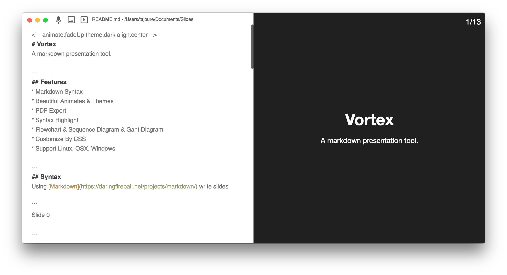
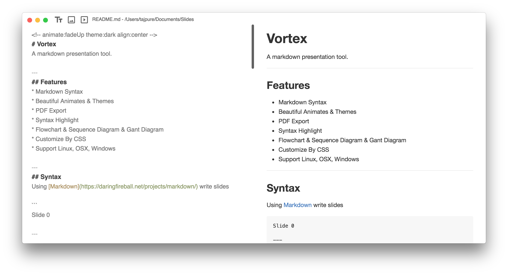
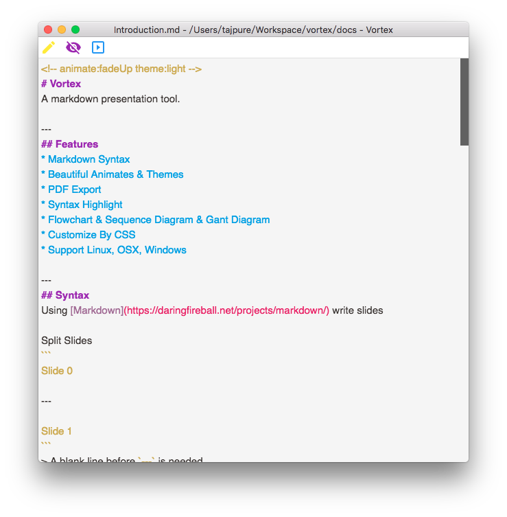

# Vortex
A powerful markdown presentation tool.

# Features
* Markdown Syntax
* Beautiful Animates & Themes
* PDF Export
* Syntax Highlight
* Flowchart & Sequence Diagram & Gant Diagram
* Customize By CSS
* Support Linux, OSX, Windows

# Installation
https://github.com/tajpure/vortex/releases

# Getting Started
Visit [here](https://github.com/tajpure/vortex/wiki) to kown how to use Vortex.

# Screenshots
## Presentation Mode


## Markdown Mode


## Without Preview


# Contribute
## Install dependencies
```
npm install
```
## Start
```
npm start
```
## Package
You can change the release platform in config.js.
```
npm run release
```

# Acknowledgements:
* [Electron](http://electron.atom.io/)
* [Vue](http://vuejs.org/)
* [Katex](https://github.com/Khan/KaTeX)
* [Animate.css](https://daneden.github.io/animate.css/)
* [Marked](https://github.com/chjj/marked)
* [mermaid](https://github.com/knsv/mermaid)
* [Marp](https://yhatt.github.io/marp/)

# License
MIT
