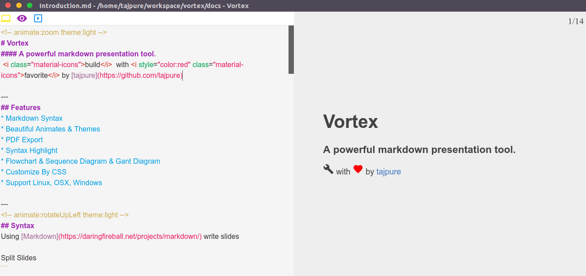

# Vortex
A powerful markdown presentation tool.

# Screenshots

# Features
* Markdown Syntax
* Beautiful Animates & Themes
* PDF Export
* Syntax Highlight
* Flowchart & Sequence Diagram & Gant diagram
* Customize By CSS
* Support Linux, OSX, Windows

# Getting Started
You can open this [file](https://raw.githubusercontent.com/tajpure/vortex/master/docs/Introduction.md)
by Vortex to know how to use it.

# Animates
* flash
* rubberBand
* shake
* headShake
* swing
* tada
* wobble
* jello
* bounce
* bounceDown
* bounceLeft
* bounceRight
* bounceUp
* fade
* fadeDown
* fadeDownBig
* fadeLeft
* fadeLeftBig
* fadeRight
* fadeRightBig
* fadeUp
* fadeUpBig
* flipX
* flipY
* lightSpeed
* rotate
* rotateDownLeft
* rotateDownRight
* rotateUpLeft
* rotateUpRight
* hinge
* roll
* zoom
* zoomDown
* zoomLeft
* zoomRight
* zoomUp
* slideDown
* slideLeft
* slideRight
* slideUp

# Themes
* light
* dark
* red
* pink
* purple
* blue
* green
* lightgreen
* lime
* yellow
* amber
* orange
* brown

# Acknowledgements:
* [Electron](http://electron.atom.io/)
* [Vue](http://vuejs.org/)
* [Katex](https://github.com/Khan/KaTeX)
* [Animate.css](https://daneden.github.io/animate.css/)
* [Marked](https://github.com/chjj/marked)
* [mermaid](https://github.com/knsv/mermaid)
* [Marp](https://yhatt.github.io/marp/)

# License
MIT
